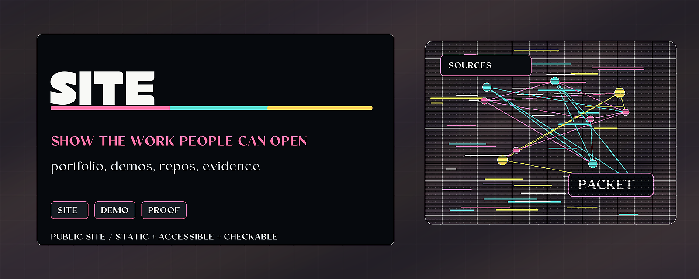

# HarperZ9.github.io



> Static public site for Project Telos: engines, demos, papers, graphics
> systems, generated media, and work routes.

HarperZ9.github.io is the public workshop surface for **Zain Dana Harper**
and Project Telos. It maps the range -- local-model workflows, codebase maps,
compiler tools, real-time graphics, color science, research infrastructure,
and clear writing -- and gives a visitor a way in: open a demo, inspect an
engine, read a paper, or start a work thread.

## Why it matters

The website has to serve both public readers and developers. Public readers
need plain language, working surfaces, and visible status; developers need
runnable demos, repo links, and a path from the page to the code behind it.
Rigor stays present as infrastructure -- source links, tests, dates, maturity
labels -- without becoming the headline of every page.

## Try it

```powershell
git clone https://github.com/HarperZ9/HarperZ9.github.io.git
cd HarperZ9.github.io
npx serve -l 8765 .
```

Use a server that gives `.mjs` files a JavaScript MIME type (`npx serve`
does). `python -m http.server` serves `.mjs` as `text/plain` on some Windows
setups, which silently breaks the Studio's module graph.

## What to test first

- Open `http://127.0.0.1:8765/`.
- Check the first viewport orients a new visitor: who this is, what the range
  is, where to enter.
- Verify public repo links, sample pages, and mobile/desktop readability.

## Current status

Static public portfolio and product-surface site. It should stay inspectable,
accessible, and honest about maturity; private systems stay bounded off-page.

## Pages

- `index.html` -- generative home, built from source in `home/` (Vite + React;
  `cd home && npm run deploy` rebuilds `index.html` and `assets/`).
- `papers/` -- direct PDFs of the six published papers, built from the
  LaTeX sources with tectonic.
- `overview.html` -- the engine room: the flagship lineup.
- `studio.html` -- the Studio, a live media instrument for rendering and
  measuring the frame.
- `demo-index.html` -- runnable browser demos.
- `research.html` | `publications.html` -- research index and papers.
- `writing.html` -- essays, notes, and the public test-case intake.
- `catalog.html` | `guide.html` -- the full catalog and the site guide.
- `typeface.html` -- Telos Display specimen and synthesis notes.
- `cv.html` | `person.html` | `resume.html` -- about and career surfaces.

## Public lineup

| Group | Public repos | State |
| --- | --- | --- |
| Verification lane | `accountable-surface`, `proof-surface`, `coherence-membrane`, `emet`, `accountable-engine`, `repo-proof-index` | Verification and review tooling: perceive, gate, act, re-check. Tested; on PyPI / public. |
| Provenance & release | `provenance-sensorium`, `model-provenance-validator`, `public-surface-sweeper`, `release-surface-scanner`, `secret-redact-io` | Witness, provenance, and release-surface CLIs. |
| Agent workflow | `agent-audit`, `agent-hook-pack`, `agent-routing-kit`, `context-curator-lite`, `workflow-harness-lite`, `index` | Small, low-/zero-dependency utilities and plugin extractions. |
| Compilers & QuantaLang | `quantalang`, `quantalang-vscode`, `quantalang-tmLanguage`, `quanta-universe` | A typed-effects language (the heavy repo) plus editor support and an alpha showcase. |
| Systems, graphics & color | `signal-kernels`, `anomaly-kernels`, `gpu-trace-validator`, `quanta-color` | Header-only C++ kernels, a GPU-trace validator, and color tools. |
| Experimental hold | `calibrate-pro` | Source and release artifacts exist, but end-to-end behavior and the complete menu-action surface are not verified. Excluded from promotion pending documented verification. |

Private platform and product work exists behind these leaves; public claims stay
limited to outcomes and categories, never internals.

## Local verification

Serve this directory locally (see **Try it** above for the MIME caveat), then
visit `http://127.0.0.1:8765/`. Before publishing, verify:

- The first viewport orients: range, entry points, working surfaces.
- Internal links and `*-sample.html` resolve; no link 404s.
- External GitHub links point at intended public repositories.
- The page stays legible at desktop and mobile widths.
- No secrets, generated logs, or private artifacts are staged.

Test suites:

```powershell
python -m pytest tests -q
node --test system
node tests/linkcheck.mjs
```

## For developers

Keep the public README, examples, and repository metadata aligned with current
behavior. Before opening a PR or publishing a release, verify the working tree
and any documented commands for this repo.

```bash
git status --short
```
