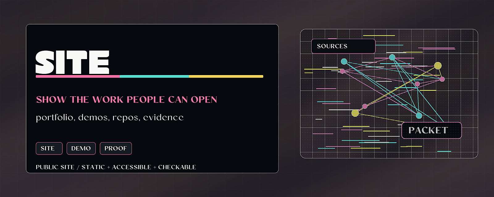

# HarperZ9.github.io



> Static public site for the Zentropy Labs portfolio, demos, repos, and evidence.

The public site surface for **Zain Dana Harper** (HarperZ9). It links the
portfolio, flagship tools, sample reports, creative demos, proof surfaces, and
developer entry points a visitor can open and inspect.

## The thesis

One accountable perception-and-action loop: a model perceives only through
**witnessed** organs, acts only through a **gate** it cannot talk past,
**journals** everything, and **verifies** its own work by re-perceiving. The
public repos are the organs; **Flywheel** composes them into the live loop.

The product infrastructure that makes people stop double-checking every answer
is not a better model — it is a receipt discipline that makes agent actions
auditable. **Proof before trust.**

## Try it

```powershell
git clone https://github.com/HarperZ9/HarperZ9.github.io.git
cd HarperZ9.github.io
python -m http.server 8765
```

Open `http://127.0.0.1:8765/`.

## The stack

| Component | Repo | What it does |
| --- | --- | --- |
| **Flywheel** | [local-model](https://github.com/HarperZ9/local-model) | The engine: verified-inference harness, agent loop, gateway, lanes, receipt-wrapped tool calls, routing |
| **Flywheel Desktop** | [flywheel-desktop](https://github.com/HarperZ9/flywheel-desktop) | Native Flutter client (no browser, offline-first) |
| **buildlang / buildc** | [buildlang](https://github.com/HarperZ9/buildlang) | Compiler + epistemics engine: capability-typed sealed receipts for verified computation |
| **gather** | [gather](https://github.com/HarperZ9/gather) | Research intake + provenance receipts; accountable pilot evidence engine |
| **crucible** | [crucible](https://github.com/HarperZ9/crucible) | Falsifiable verification (thesis to MATCH / DRIFT / UNVERIFIABLE) |
| **index** | [index](https://github.com/HarperZ9/index) | Workspace map + symbol graph + verified wiki + context envelopes |
| **forum** | [forum](https://github.com/HarperZ9/forum) | Witnessed causal ledger + model-agnostic routing + approval gates |
| **learn** | [learn](https://github.com/HarperZ9/learn) | Accountable learning forge (spaced repetition, retrieval, teach-you loop) |
| **telos** | [telos](https://github.com/HarperZ9/telos) | The reconciliation lane: five-tool workflow, creative engine, doctors, proof packets |
| **EMET** | [emet](https://github.com/HarperZ9/emet) | Closed verdict lattice + portable witness receipts |

## What is new (2026-07-31)

- **Receipt-wrapped agent tool-calls**: every tool invocation in the agent loop
  now carries a sealed, chain-linked receipt (capability class, admission,
  witnessed I/O digests). The enforced AgentRiskBOM. [PR #22](https://github.com/HarperZ9/local-model/pull/22)
- **Cross-language verify arm**: `buildc receipt verify` reads tool-call
  receipts in Rust, golden-pinned against the Python emit side. [PR #36](https://github.com/HarperZ9/buildlang/pull/36)
- **Gather pilot evidence engine**: a portable `gather pilot` command (run /
  refresh / verify / bundle) that turns mixed sources into a verifiable corpus. [PR #14](https://github.com/HarperZ9/gather/pull/14)
- **Native client canonical**: Flywheel Desktop is the primary UI; the browser
  shell is a dev/CI fallback. [PR #21](https://github.com/HarperZ9/local-model/pull/21)

## CoSAI alignment

The stack's receipt-discipline spine maps directly to CoSAI Workstream 4
(Secure Design Patterns for Agentic Systems):

- **Tool Design runbook** — the tool-call receipt is a reference implementation
- **MCP Runtime Isolation runbook** — capability classification (read / write / exec / mcp)
- **Trust-Aware Dataplane RFC** — the transitive-witness DAG

Apache 2.0 (code) / CC-BY 4.0 (docs) — matching CoSAI's license terms.

## Local verification

```powershell
python -m http.server 8765
```

Visit `http://127.0.0.1:8765/`. Verify: first viewport, internal links,
external GitHub links, mobile/desktop legibility, no secrets staged.

## For developers

Keep the public README, examples, and repository metadata aligned with current
behavior. Before opening a PR or publishing a release, verify the working tree.

```bash
git status --short
```
